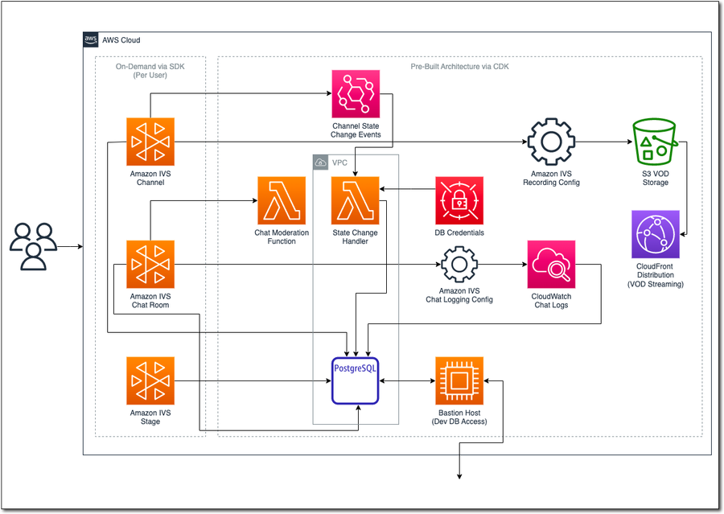
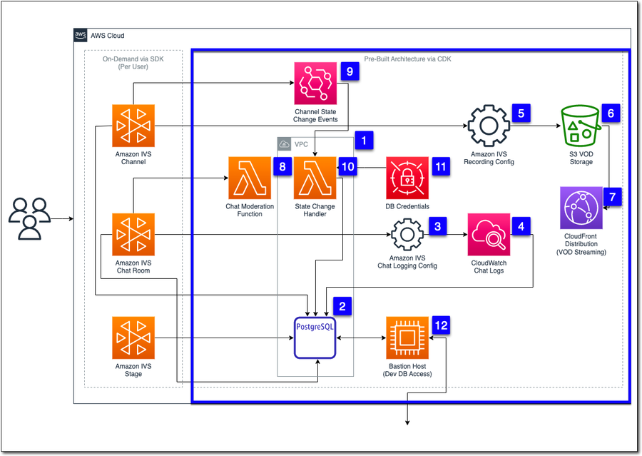
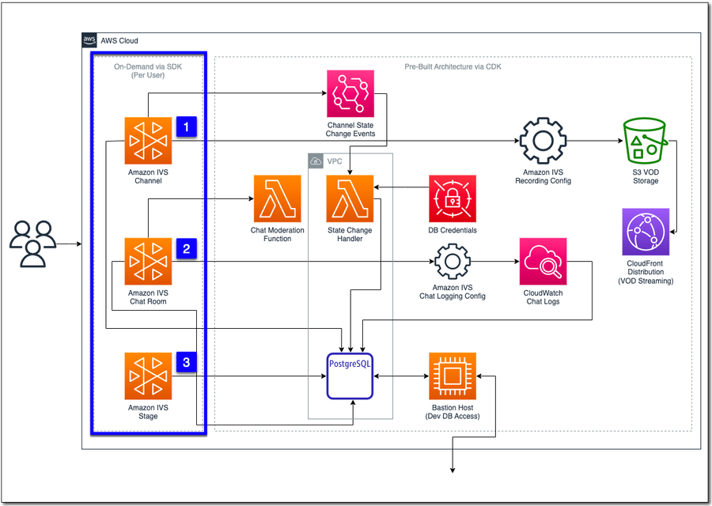

# Amazon IVS UGC Sample

This project contains a sample application called StreamCat which is a user-generated content live streaming application. In order to reach the widest possible audience of developers, this project intentionally avoid using popular frameworks like React and Angular. StreamCat is a monolithic application with the router, service tier, and views bundled in a single application. This may or may not be the best architecture for your application, but it's the best way to keeps things uncomplicated for a sample application like this.

## Overview

StreamCat is a user generated content (UGC) application. This means that users can create an account and start live streaming to viewers around the world in less than 60 seconds. When a new user is created in StreamCat, the application creates dedicated Amazon IVS channel, chat room, and stage resources and stores data related to those resources in a database.

### Broadcasting

StreamCat users can broadcast to their channel via third-party streaming software (like OBS, StreamLabs, etc) or directly from their web browser. To stream from a third-party application, users can copy their ingest endpoint and private stream key and paste those values into the third-party application to begin streaming directly to their channel.

For web broadcast, StreamCat offers two options. The first option is a "solo" broadcast option for "talking head" style streams where users can stream their webcam, microphone, and optionally share their screen. The second option is a "multi-host" option that gives the streamer the ability to invite other streamers to join their stream for more conversational or "talk show" type streams.

### Playback

Each user's stream is public. This means that anyone can view their stream by discovering it via the application homepage, category specific listings, or by direct link to the user's channel. While live streaming, each channel will display the current number of stream viewers.

> **Note**: Amazon IVS supports private channels that utilize playback tokens to prevent unauthorized viewing, but this feature was not included in the StreamCat application. Refer to the Amazon IVS docs to learn more about setting up [private channels](https://docs.aws.amazon.com/ivs/latest/userguide/private-channels.html) for authorized playback.

#### Video On Demand (VOD)

When a user streams to their channel, the stream is recorded for on-demand playback at a future time.

### Chat

Each user's channel includes a dedicated chat room where viewers can chat with each other and the streamer. Chat messages are logged to CloudWatch, eventually persisted to the application database, and replayed during VOD playback.

Chat messages are moderated via automated moderating (automatic profanity replacement) and can also be manually deleted by the streamer directly. Chatters who continue to post unwelcomed messages can be disconnected by the streamer.

### Social Features

StreamCat includes several additional features that are familiar to users of UGC applications such as the ability to follow other channels. Channels that have recently gone live are listed on the application home page, and users can additionally discover live streams by category. Recent VODs are also displayed on both the home page and the individual user channels.

### Stream Metrics and Analytics

Playback metrics like buffer size, latency, stream bitrate are collected during playback and persisted to the database. Browser specific data is also collected. This data is aggregated and is presented for analysis for the streamer.

## Architecture

The StreamCat application architecture is divided into two categories: a collection of pre-built resources that are deployed via the AWS Cloud Development Kit (CDK), and several resources that are created on-demand by the application itself via the AWS SDK for JavaScript (v3) when users register a new account in the application.



## Pre-Built Resources



## On-Demand Resources



## Learn More

To learn more about this application, please refer to the videos located at:

https://www.youtube.com/playlist?list=PL5bUlblGfe0LlYN2N55FbJMK4ODo82auM

This project is intended for education purposes only and not for production usage.

## Getting Started

Create an [SSH Key Pair](https://us-east-1.console.aws.amazon.com/ec2/home?region=us-east-1#KeyPairs:) named `id_aws` for Bastion Host

## Deploy Pre-Built Architecture

In the `cdk` directory, run `cdk deploy`.

Use the values from the CDK Output in the commands below.

## DB Setup

Retrieve the generated master DB password:

```bash
aws secretsmanager get-secret-value --secret-id [DBMasterPasswordArn]
```

Connect to new Postgres database using the [bastion host](https://repost.aws/knowledge-center/rds-connect-using-bastion-host-linux).

```bash
ssh -i ~/.ssh/id_aws.pem -f -N -l ec2-user -L 5432:[DbHost]:5432 ec2-user@[BastionHostIp]
```

Connect to DB from localhost with the user `postgres` and the generated password that you retrieved above.

```bash
psql -h localhost -U postgres
```

Create a user called `streamcat`, with a unique password.

```sql
create user streamcat with password '[NEW USER PASSWORD]';
```

Connect to DB with `streamcat` user:

```bash
psql -h localhost -U streamcat streamcat
```

## Application Config

Update environment variables:

- Rename `.env.example` to `.env`
- Set DB Credentials in `.env`
- Run `node ace migration:run`
- Run `node ace db:seed`

Create DB Credentials secret (used by Lambda function to connect to DB):

```bash
aws secretsmanager create-secret --name '/streamcat/db-creds' --secret-string '{"dbUser": "streamcat", "dbPassword": "[NEW USER PASSWORD]", "dbHost": "[DbHost]", "dbDatabase": "streamcat"}'
```

## Running the Application

Using the CDK output, populate the `.env` file located in `web/` with the necessary values for recording configuration, etc.

To run the application:

```bash
$ node ace serve --watch
```

## Destroy

Run `cdk destroy`.

**Note**: This application will create additional resources "on-demand" via the AWS SDK for JavaScript. Running `cdk destroy` will not delete these resources. To manually delete the on-demand resources, search for resources tagged with 'project=streamcat' as shown below.

Finding all resources created by this application.

```bash
$ aws resourcegroupstaggingapi get-resources --tag-filters Key=project,Values=streamcat
```
